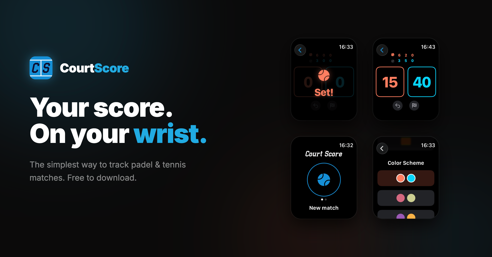

# CourtScore



**Your score. On your wrist.**

A smartwatch app for tracking padel tennis match scores in real-time — built for players who need to stay focused on the game, not on keeping count.

Available on Apple Watch and Wear OS.

---

## What It Does

CourtScore handles the full scoring lifecycle of a padel match:

- **Point-by-point tracking** — 0 / 15 / 30 / 40 / Advantage, automatically handled
- **Game and set progression** — best of 3 sets with automatic tie-break detection at 6-6
- **Serve indicator** — always know who's serving
- **Undo** — step back through the full match history
- **Scoring modes** coming soon — Advantage, Golden Point, or Star Point
- **Set celebrations** — animated feedback when a set is won
- **Match completion** — confirmation dialogs to prevent accidental endings

All interactions are single-tap. No typing, no menus mid-match.

---

## Tech Stack

CourtScore is a **Kotlin Multiplatform** project with platform-native watch UIs.

```
shared/          Kotlin Multiplatform — domain models, scoring engine, ViewModel
androidApp/      Wear OS — Jetpack Compose + Wear Compose
iosApp/          watchOS — SwiftUI + WatchKit
```

| Layer | Android | iOS |
|---|---|---|
| UI | Wear Compose | SwiftUI |
| State | `MatchViewModel` (KMM shared) | `MatchViewModel` (KMM shared) |
| Language | Kotlin | Swift |
| Min SDK | Wear OS API 30 | watchOS (WatchKit) |

### Shared Module

The core logic lives in `shared/` and is compiled for both platforms:

- **`MatchEngine`** — all scoring rules, tie-break logic, deuce/advantage handling
- **`MatchViewModel`** — exposes match state as observable flow
- **Domain models** — `MatchScore`, `GameScore`, `SetScore`, `Point`, `ScoringType`

---

## Project Structure

```
CourtScore/
├── shared/                          # Kotlin Multiplatform (shared logic)
│   └── src/commonMain/kotlin/
│       └── com/linca/courtscore/
│           ├── domain/model/        # Core data models
│           ├── engine/              # MatchEngine (scoring rules)
│           └── presentation/        # MatchViewModel
│
├── androidApp/                      # Wear OS app
│   └── src/main/java/
│       └── com/linca/courtscore/
│           ├── presentation/        # Screens + Compose UI + theme
│           └── data/                # Preferences, locale handling
│
├── iosApp/                          # Apple Watch app
│   └── CourtScore Watch App/        # SwiftUI screens + managers
│
└── docs/                            # Marketing assets, screenshots
```

---

## Features

### Scoring
- Standard padel scoring (games, sets, match)
- Automatic tie-break at 6-6
- Three deuce formats: Advantage, Golden Point, Star Point
- Full undo history

### Customization
- Multiple color schemes
- Language support: English, Spanish (Español), Catalan (Català)
- System language detection with manual override

### UX
- Single-tap score updates
- Serve indicator
- Animated set win celebrations
- Back-press confirmation to prevent accidental exits

---

## Version

**v1.2.1** (build 9)

---

## License

Private — all rights reserved.